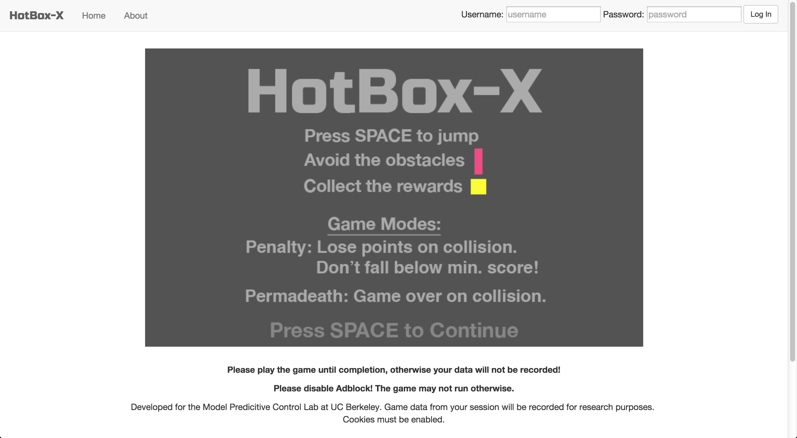
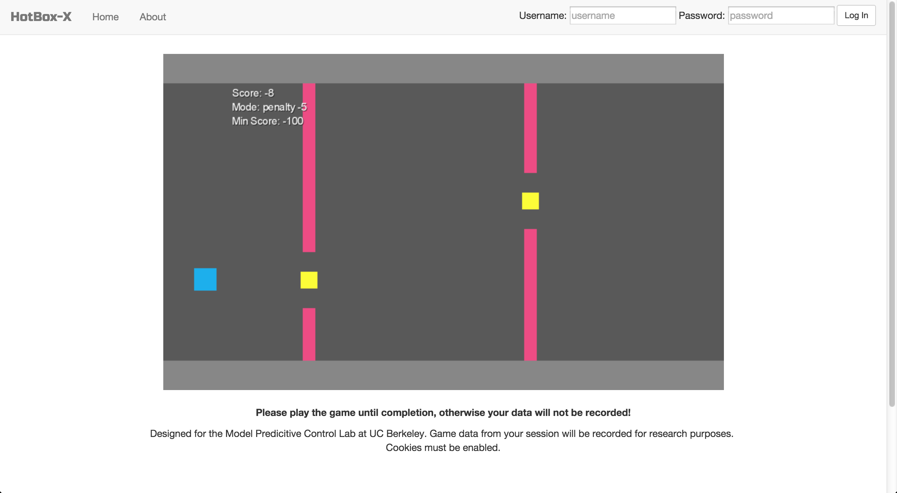
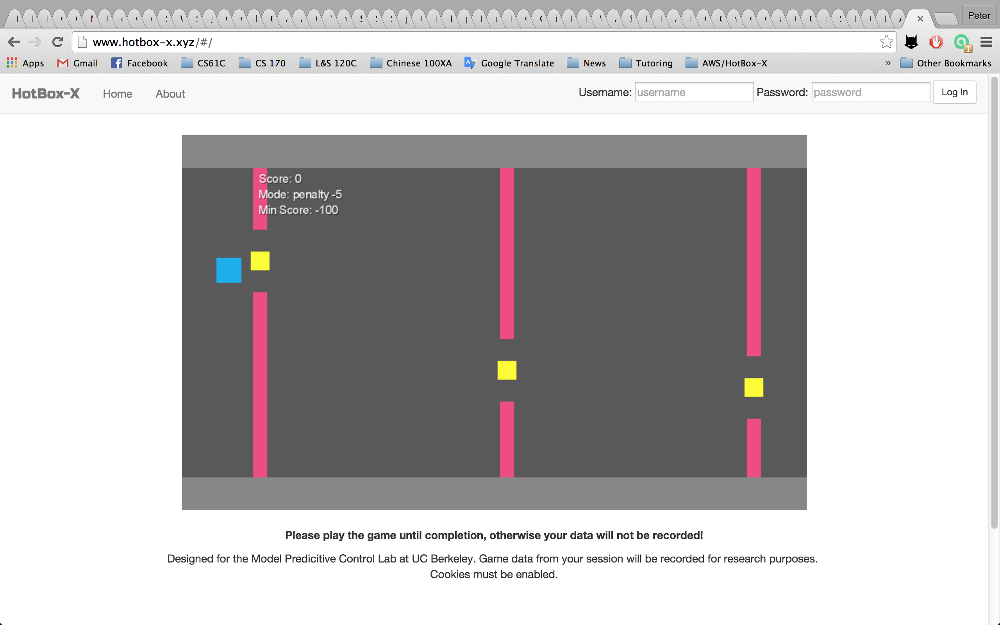
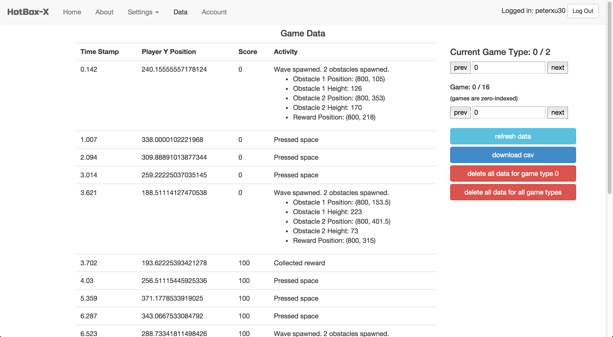

# HotBox-X-Server
Web App for HotBox-X, a game designed for the Model Predictive Control Lab at Berkeley. The goal is to collect player data to form models of human decision making.

This app hosts the website the game is located on as well as the REST endpoint for getting/posting game settings and research data. Written using the MEAN stack.

**2019 Update:** This app is no longer hosted. Below are screenshots of what the game looked like. The game codebase can be found [here](https://github.com/peterxu30/HotBox-X).

### Home Screen

### Gameplay

### Settings

### Data

